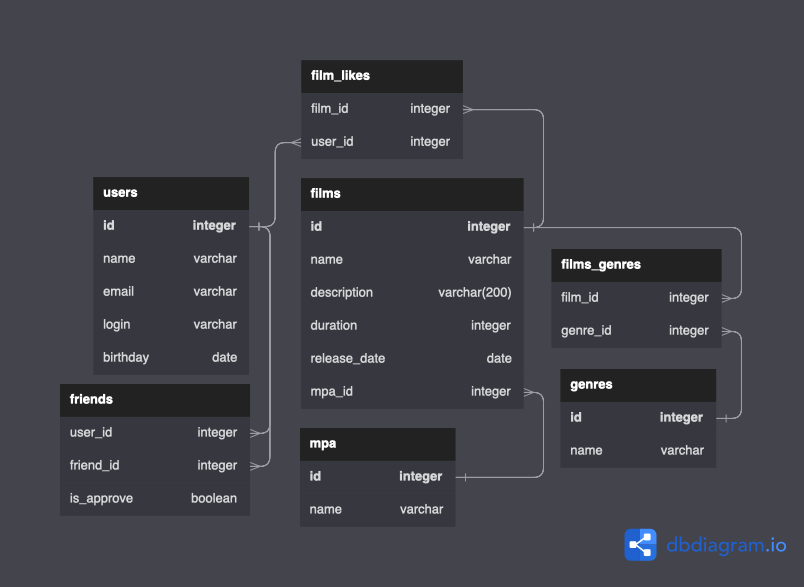

# java-filmorate


# Описание БД



https://dbdiagram.io/d/64a18fe402bd1c4a5e5e7cb0

### Таблица `users`
Хранит в себе всех зарегистрированных пользователей

Колонки:
1. id - pk
2. name - имя
3. email - почта (обязательное, email)
4. login - логин (обязательное, непустое)
5. birthday - дата рождежния (обязательное, в прошлом)

### Таблица `friends`
Хранит в себе связи "друзья" пользователей

Колонки:
1. user_id - `pk` из таблицы `users` (обязательное)
2. friend_id - `pk` из таблицы `users` (обязательное)
3. is_approve - флаг, который указывание на статус связи (подтвержденная или нет) (обязательное, по дефолту - `false`)

### Таблица `films`
Хранит в себе все фильмы

Колонки:
1. id - pk
2. name - имя фильма (обязательное, непустое)
3. description - описание (обязательное)
4. duration - продолжительность в секундах (обязательное)
5. release_date - дата релиза фильма (обязательное)
6. mpa_id integer - рейтинг MPA. `pk` из таблицы `mpa`

### Таблица `film_likes`
Хранит в себе все лайки фильмов

Колонки:
1. film_id - `pk` из таблицы `films`
2. user_id - `pk` из таблицы `users`


### Таблица `genres`
Хранит в себе все доступные жанры фильмов

Колонки:
1. id - pk
2. name - имя

### Таблица `mpa`
Хранит в себе все рейтинги MPA

Колонки:
1. id - pk
2. name - имя

### Таблица `films_genres`
Хранит в себе все жанры фильмов

Колонки:
1. film_id - `pk` из таблицы `films`
2. genre_id - `pk` из таблицы `genres`

## Примеры запросов

### Получение общих друзей пользователей с id "1" и "2"
```postgresql
SELECT *
FROM users
WHERE id IN (SELECT DISTINCT user_id
             FROM friends
             WHERE friend_id = 1
                OR friend_id = 2)
         AND id NOT IN (1, 2);
```

### Получение всех фильмов с рейтингом "PG"
```postgresql
SELECT *
FROM films
WHERE mpa_id IN (SELECT id
                FROM mpa
                WHERE name = 'PG');
```

### Получение всех фильмов с жанром "комедия"
```postgresql
SELECT *
FROM films
WHERE id IN (SELECT film_id
                  FROM films_genres
                  WHERE genre_id IN (SELECT id
                                     FROM genres
                                     WHERE name = 'COMEDY'));
```
